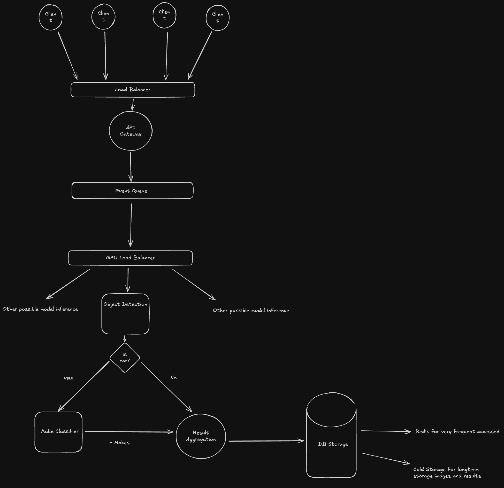

# Scaling and Extensibility Strategy

This document outlines the strategy for scaling the vision pipeline to handle 10 million images per day and for extending its capabilities with additional classification models.

## 1. Scaling to 10 Million Images per Day


**Key Components**:

1.  **API Gateway**: A single entry point for all incoming image processing requests. Before get in this point the client traffic should pass through a Load Balancer to avoid possible API overloads 

2.  **Message Queue**:
    -   Decouples the request intake from the processing pipeline.
    -   The API Gateway publishes a message to the queue for each image, containing metadata like the image location (e.g., an S3 bucket URL).
    -   Provides persistence and allows the processing workers to consume images at their own pace, preventing overload.

3.  **Processing Workers (Microservices)**:
    -   Independent, containerized services (using Docker) that subscribe to the message queue.
    -   Each worker pulls a message, downloads the image, runs the vision pipeline, and stores the results.
    -   **Types of Workers**:
        -   `object-detection-worker`: Runs the YOLO model.
        -   `car-make-worker`: Runs the ViT model for car make classification.

4.  **Optimized Model Serving** (e.g. Inference Servers):
    -   Use a dedicated inference server to load the models.
    -   This allows for batching requests, concurrent model execution, and efficient GPU utilization, significantly increasing throughput.



## 2. Adding More Classifications

The pipeline should be flexible enough to easily add new classification models without modifying existing code. This can be achieved through a modular, configuration-driven approach.

**Proposed Design**:

1.  **Classifier Abstraction**: 

    ```python
    from abc import ABC, abstractmethod

    class BaseClassifier(ABC):
        @abstractmethod
        def process(self, image, context: dict) -> dict:
            """Process an image and return classification results."""
            pass

        @property
        @abstractmethod
        def name(self) -> str:
            """Return the unique name of the classifier."""
            pass
    ```

2.  **Dynamic Pipeline Configuration**: The main pipeline will be driven by a configuration file (e.g., `config.yaml`) that defines the sequence of classifiers to run and any dependencies between them.

    **Example `config.yaml`**:

    ```yaml
    pipeline:
      - name: object_detection
        class: classification.objects.ObjectClassfier

      - name: car_make_classification
        class: classification.makes.StanfordViT
        depends_on: object_detection # Depends on the output of object detection
        condition: "'car' in context['object_detection']['detected_classes']"

      - name: tshirt_color_classification
        class: classification.attributes.TShirtColorClassifier
        depends_on: object_detection
        condition: "'person' in context['object_detection']['detected_classes']"
    ```

3.  **Pipeline Execution Engine**: The `VisionPipeline` will read this configuration, instantiate the required classifiers, and execute them in the correct order, passing context as needed.

**Example: Adding a T-Shirt Color Classifier**

1.  **Create the Classifier**:
    -   Develop the model and create `classification/attributes/tshirt_color.py`.
    -   Implement the `TShirtColorClassifier` class, inheriting from `BaseClassifier`.
    -   The `process` method would take the image and the bounding box of the detected 'person' from the context.

2.  **Update Configuration**:
    -   Add the new classifier to `config.yaml` as shown in the example above.

3.  **Deploy**:
    -   The pipeline will automatically load and run the new classifier for images containing a person, with no changes needed to the core `VisionPipeline` code.

This approach makes the system highly extensible and maintainable, allowing for the rapid integration of new models as business requirements evolve.
